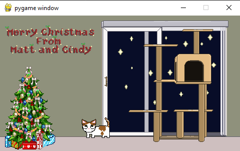

# interactive-christmas-card
A fun interactive Christmas card where you can control the cat, Sprites were all drawn with Aseprite and code was written in Python 3.9.0

Required Libraries:
-Pygame

*I had issues with Numpy being unneccessarily involved, so I disabled it for this environment since it isn't neccessary and that fixed the error.  If you want to add to this and need Numpy functionality, you may want to try earlier versions.
